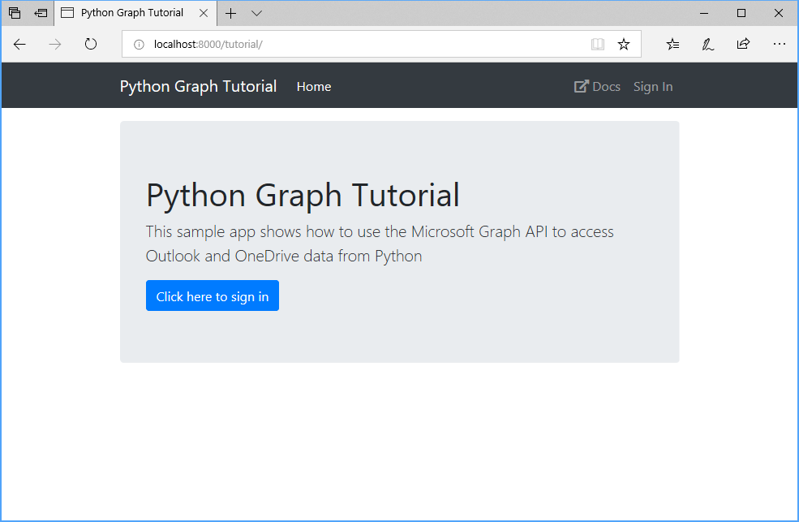

<!-- markdownlint-disable MD002 MD041 -->

In this exercise you will use [Django](https://www.djangoproject.com/) to build a web app.

1. If you don't already have Django installed, you can install it from your command-line interface (CLI) with the following command.

    ```Shell
    pip install Django==3.2
    ```

1. Open your CLI, navigate to a directory where you have rights to create files, and run the following command to create a new Django app.

    ```Shell
    django-admin startproject graph_tutorial
    ```

1. Navigate to the **graph_tutorial** directory and enter the following command to start a local web server.

    ```Shell
    python manage.py runserver
    ```

1. Open your browser and navigate to `http://localhost:8000`. If everything is working, you will see a Django welcome page. If you don't see that, check the [Django getting started guide](https://www.djangoproject.com/start/).

1. Add an app to the project. Run the following command in your CLI.

    ```Shell
    python manage.py startapp tutorial
    ```

1. Open **./graph_tutorial/settings.py** and add the new `tutorial` app to the `INSTALLED_APPS` setting.

    :::code language="python" source="../demo/graph_tutorial/graph_tutorial/settings.py" id="InstalledAppsSnippet" highlight="8":::

1. In your CLI, run the following command to initialize the database for the project.

    ```Shell
    python manage.py migrate
    ```

1. Add a [URLconf](https://docs.djangoproject.com/en/3.0/topics/http/urls/) for the `tutorial` app. Create a new file in the **./tutorial** directory named `urls.py` and add the following code.

    ```python
    from django.urls import path

    from . import views

    urlpatterns = [
      # /
      path('', views.home, name='home'),
      # TEMPORARY
      path('signin', views.home, name='signin'),
      path('signout', views.home, name='signout'),
      path('calendar', views.home, name='calendar'),
    ]
    ```

1. Update the project URLconf to import this one. Open **./graph_tutorial/urls.py** and replace the contents with the following.

    :::code language="python" source="../demo/graph_tutorial/graph_tutorial/urls.py" id="UrlConfSnippet":::

1. Add a temporary view to the `tutorials` app to verify that URL routing is working. Open **./tutorial/views.py** and replace its entire contents with the following code.

    ```python
    from django.shortcuts import render
    from django.http import HttpResponse, HttpResponseRedirect
    from django.urls import reverse
    from datetime import datetime, timedelta

    def home(request):
      # Temporary!
      return HttpResponse("Welcome to the tutorial.")
    ```

1. Save all of your changes and restart the server. Browse to `http://localhost:8000`. You should see `Welcome to the tutorial.`

## Install libraries

Before moving on, install some additional libraries that you will use later:

- [Microsoft Authentication Library (MSAL) for Python](https://github.com/AzureAD/microsoft-authentication-library-for-python) for handling sign-in and OAuth token flows.
- [PyYAML](https://pyyaml.org/wiki/PyYAMLDocumentation) for loading configuration from a YAML file.
- [python-dateutil](https://pypi.org/project/python-dateutil/) for parsing ISO 8601 date strings returned from Microsoft Graph.

1. Run the following command in your CLI.

    ```Shell
    pip install msal==1.10.0
    pip install pyyaml==5.4.1
    pip install python-dateutil==2.8.1
    ```

## Design the app

1. Create a new directory in the **./tutorial** directory named `templates`.

1. In the **./tutorial/templates** directory, create a new directory named `tutorial`.

1. In the **./tutorial/templates/tutorial** directory, create a new file named `layout.html`. Add the following code in that file.

    :::code language="html" source="../demo/graph_tutorial/tutorial/templates/tutorial/layout.html" id="LayoutSnippet":::

    This code adds [Bootstrap](http://getbootstrap.com/) for simple styling, and [Fabric Core](https://developer.microsoft.com/fluentui#/get-started#fabric-core) for some simple icons. It also defines a global layout with a nav bar.

1. Create a new directory in the **./tutorial** directory named `static`.

1. In the **./tutorial/static** directory, create a new directory named `tutorial`.

1. In the **./tutorial/static/tutorial** directory, create a new file named `app.css`. Add the following code in that file.

    :::code language="css" source="../demo/graph_tutorial/tutorial/static/tutorial/app.css":::

1. Create a template for the home page that uses the layout. Create a new file in the **./tutorial/templates/tutorial** directory named `home.html` and add the following code.

    :::code language="html" source="../demo/graph_tutorial/tutorial/templates/tutorial/home.html" id="HomeSnippet":::

1. Open the `./tutorial/views.py` file and add the following new function.

    :::code language="python" source="../demo/graph_tutorial/tutorial/views.py" id="InitializeContextSnippet":::

1. Replace the existing `home` view with the following.

    :::code language="python" source="../demo/graph_tutorial/tutorial/views.py" id="HomeViewSnippet":::

1. Add a PNG file named **no-profile-photo.png** in the **./tutorial/static/tutorial** directory.

1. Save all of your changes and restart the server. Now, the app should look very different.

    
