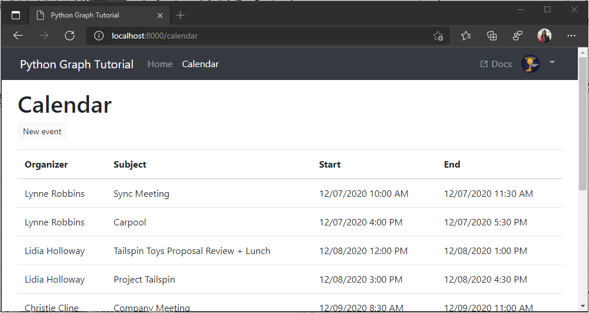

<!-- markdownlint-disable MD002 MD041 -->

In this exercise you will incorporate the Microsoft Graph into the application.

## Get calendar events from Outlook

1. Start by adding a method to **./tutorial/graph_helper.py** to fetch a view of the calendar between two dates. Add the following method.

    :::code language="python" source="../demo/graph_tutorial/tutorial/graph_helper.py" id="GetCalendarSnippet":::

    Consider what this code is doing.

    - The URL that will be called is `/v1.0/me/calendarview`.
        - The `Prefer: outlook.timezone` header causes the start and end times in the results to be adjusted to the user's time zone.
        - The `startDateTime` and `endDateTime` parameters set the start and end of the view.
        - The `$select` parameter limits the fields returned for each events to just those the view will actually use.
        - The `$orderby` parameter sorts the results by start time.
        - The `$top` parameter limits the results to 50 events.

1. Add the following code to **./tutorial/graph_helper.py** to lookup an [IANA time zone identifier](https://www.iana.org/time-zones) based on a Windows time zone name. This is necessary because Microsoft Graph can return time zones as Windows time zone names, and the Python **datetime** library requires IANA time zone identifiers.

    :::code language="python" source="../demo/graph_tutorial/tutorial/graph_helper.py" id="ZoneMappingsSnippet":::

1. Add the following view to **./tutorial/views.py**.

    ```python
    def calendar(request):
      context = initialize_context(request)
      user = context['user']

      # Load the user's time zone
      # Microsoft Graph can return the user's time zone as either
      # a Windows time zone name or an IANA time zone identifier
      # Python datetime requires IANA, so convert Windows to IANA
      time_zone = get_iana_from_windows(user['timeZone'])
      tz_info = tz.gettz(time_zone)

      # Get midnight today in user's time zone
      today = datetime.now(tz_info).replace(
        hour=0,
        minute=0,
        second=0,
        microsecond=0)

      # Based on today, get the start of the week (Sunday)
      if (today.weekday() != 6):
        start = today - timedelta(days=today.isoweekday())
      else:
        start = today

      end = start + timedelta(days=7)

      token = get_token(request)

      events = get_calendar_events(
        token,
        start.isoformat(timespec='seconds'),
        end.isoformat(timespec='seconds'),
        user['timeZone'])

      context['errors'] = [
        { 'message': 'Events', 'debug': format(events)}
      ]

      return render(request, 'tutorial/home.html', context)
    ```

1. Open **./tutorial/urls.py** and replace the existing `path` statements for `calendar` with the following.

    ```python
    path('calendar', views.calendar, name='calendar'),
    ```

1. Sign in and click the **Calendar** link in the nav bar. If everything works, you should see a JSON dump of events on the user's calendar.

## Display the results

Now you can add a template to display the results in a more user-friendly manner.

1. Create a new file in the **./tutorial/templates/tutorial** directory named `calendar.html` and add the following code.

    :::code language="html" source="../demo/graph_tutorial/tutorial/templates/tutorial/calendar.html" id="CalendarSnippet":::

    That will loop through a collection of events and add a table row for each one.

1. Replace the `calendar` view in **./tutorial/views.py** with the following code.

    :::code language="python" source="../demo/graph_tutorial/tutorial/views.py" id="CalendarViewSnippet":::

1. Refresh the page and the app should now render a table of events.

    
