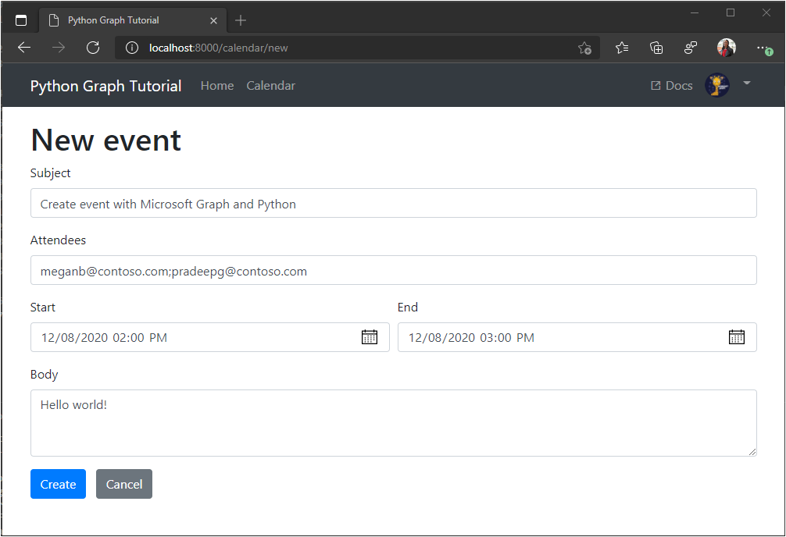

<!-- markdownlint-disable MD002 MD041 -->

In this section you will add the ability to create events on the user's calendar.

1. Add the following method to **./tutorial/graph_helper.py** to create a new event.

    :::code language="python" source="../demo/graph_tutorial/tutorial/graph_helper.py" id="CreateEventSnippet":::

## Create a new event form

1. Create a new file in the **./tutorial/templates/tutorial** directory named `newevent.html` and add the following code.

    :::code language="html" source="../demo/graph_tutorial/tutorial/templates/tutorial/newevent.html" id="NewEventSnippet":::

1. Add the following view to **./tutorial/views.py**.

    :::code language="python" source="../demo/graph_tutorial/tutorial/views.py" id="NewEventViewSnippet":::

1. Open **./tutorial/urls.py** and add a `path` statements for the `newevent` view.

    ```python
    path('calendar/new', views.newevent, name='newevent'),
    ```

1. Save your changes and refresh the app. On the **Calendar** page, select the **New event** button. Fill in the form and select **Create** to create the event.

    
